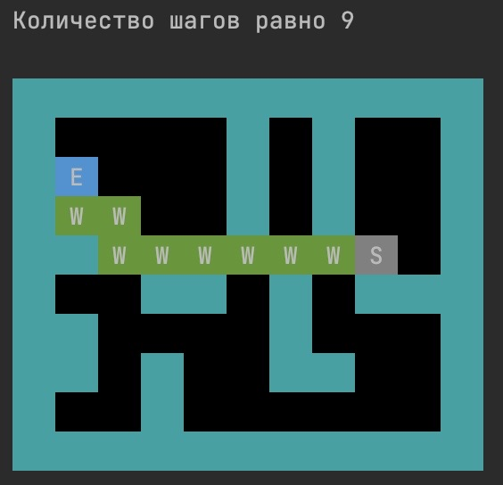

# Волновой алгоритм

Студент: Москалев Н.А.

## Файлы

* Main.java - запускает весь процесс вывода лабиринта, постановку двух точек (входа и выхода), реализацию волногового алгоритма и нахождения кратчайшего пути между точками;
* Labirint.java - содержит класс лабиринта, где в качестве поле задан двумерные массив целочисленных значений и есть методы копирования и вывода лабиринта. К сожалению, пока не хватило времени реализовать метод генерации лабиринта, поэтому пока только ручная корректировка, но обязательно разберусь, тема интересная;
* Point.java - содержит класс точки, с полями коррдинат X и Y, а также метод получения случайной точки для входа и выхода в лабиринте;
* FillLabirint.java - содержит класс заполнения лабиринта и метод для реализации волнового алгоритма;
* Way.java - содержит класс пути и метод для нахождения кратчайшего пути от точки входа до выхода;

## Принцип действия
1. Создается экземпляр класса Labirint;
2. Делается копия лабиринта;
3. Делается вывод исходного лабиринта;
4. Генерируются случайные точки для входы и выхода;
5. Делается вывод лабиринта с точками входа и выхода;
6. Реализация волнового алгоритма;
7. Вывод лабиринта с заполненными значениями от волнового алгоритма;
8. Находится кратчайший путь (нахождение происходит от выхода ко входу);
9. Делается вывод результата (исходный лабиринт с точками входа и выхода и кратчайшим путем);

### Пример результата:

# Спасибо за внимание!